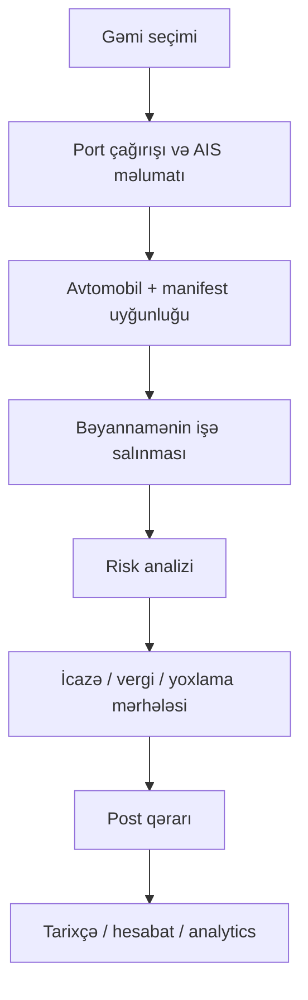

# Gömrük və Liman Əməliyyat Platforması

Bu layihə Azərbaycan liman-gömrük proseslərini vahid, operativ və vizual idarəetmə ekranı şəklində nümayiş etdirən prototipdir. Buradakı əsas fikir budur ki, gəmi, avtomobil, manifest, gömrük bəyannaməsi, risk yoxlanması, post qərarı və hesabat prosesləri ayrı-ayrı sistemlərə parçalanaraq deyil, bir “əməliyyat paneli” altında birləşdirilsin.

Layihə real gömrük və liman əməliyyatının tam istehsal versiyası deyil; bunun yerinə biznes prosesini, iş axınını və UX konsepsiyasını göstərən demo / product prototype mahiyyətindedir. Bu səbəbdən layihədə sintetik 2026 məlumatları istifadə olunur və real şəxsi və kommersiya məlumatı saxlanmır.

---

## Bu layihənin əsas məqsədi nədir?

Müasir liman və gömrük işində belə bir problem olur:

- gəmi məlumatları ayrı sistemdədir
- port çağırışları başqa modulda olur
- nəqliyyat vasitəsi və manifest başqa ekranlarda görünür
- bəyannamə və risk analizi başqa kommanda ilə aparılır
- qərar və audit başqa prosesi təşkil edir

Nəticədə rəhbər və operativ komanda tam mənzərə əldə etmir. O, işin hansı mərhələdə olduğunu, hansı statusun olduğunu və riskin nə dərəcədə olduğunu tez görmür.

Bu layihənin ideyası tam məhz budur: bütün bunları bir vahid idarəetmə ekranında toplamaq.

---

## Layihənin hansı problemleri həll etməyə çalışması nəzərdə tutulub?

1. Gəmi və liman fəaliyyətini operativ şəkildə izləmaq
2. Nəqliyyat vasitəsinin manifestə bağlanmasını asanlaşdırmaq
3. Gömrük bəyannaməsinin statusunu və riskini görmək
4. Post qərarlarının asanlaşdırılmış formalaşdırılmasını simulyasiya etmək
5. KPI, tarixçə, statistikalar və monitinqi vahid ekranda toplamaq
6. Digital transformation prosesində liman-gömrük işini vizual və anlaşılır şəkildə nümayiş etdirmək

---

## Prototipin iş axını

Proses layihədə ardıcıl şəkildə aşağıdakı kimi qurulub:



Bu axın layihənin ümumi konsepsiyasını təşkil edir. UI-də bu axın bir neçə əsas səhifədə görünür:

- Dashboard / Əməliyyat mərkəzi
- Ships / Gəmi əməliyyat mərkəzi
- Registration / Vahid qeydiyyat
- Declarations / Bəyannamələr
- History / Tarixçə
- Analytics / Analitika
- Settings / Parametrlər

---

## Əsas səhifələr və funksionallıq

### 1) Dashboard / Əməliyyat mərkəzi

Ana idarəetmə ekranıdır. Burada istifadəçi aşağıdakı məsələləri görür:

- liman ümumi göstəricilər
- gəmi statusu
- AIS / xəritə görünüşü
- riskli və növbədə olan nəqliyyat vasitələri
- aktiv sənədlər və bəyannamə konteksti
- port əməliyyatlarının qısa operativ statistikası

Bu ekran operativ qərar vermə üçün nəzərdə tutulub.

### 2) Ships / Gəmi əməliyyat mərkəzi

Bu ekran gəmi bazası, liman çağırışları və operativ göstəriciləri göstərir:

- AIS radar / xəritə görünüşü
- gəmi siyahısı və filterlər
- mövqe, status, kanal, sürət
- live hava və valyuta məlumatları
- port call ve qurum icazə məlumatları

Burada liman rəhbərliyi və koordinasiya qrupu işini görməyi asanlaşdırır.

### 3) Registration / Vahid qeydiyyat

Bu, layihənin ən vacib hissəsidir. Burada aşağıdakı ardıcıllıq formalaşır:

- gəmi seçilməsi
- avtomobil seçilməsi
- manifestin tapılması
- bəyannamənin sistemə bağlanması
- risk yoxlanması
- vergi və icazələrin yoxlanması
- post qərarının verilməsi

Bu proses real gömrük əməliyyatının əsas nüvəsidir.

### 4) Declarations / Bəyannamələr

Gömrük bəyannamələri, HS kodları, mal detalları, dəyər, valyuta, status və sənəd konteksti burada göstərilir. Bu sahənin məqsədi sənədlərin düzgün, tam və nəzarət altında saxlanılmasıdır.

### 5) History / Tarixçə

Burada post qərarları, keçmiş proseslər, audit timeline və export funksiyaları nümayiş etdirilir. Bu hissə hesabat və audit üçün vacibdir.

### 6) Analytics / Analitika

Trafik, yük, proses səmərəliliyi, liman payı və trend məlumatları burada görünür. Bu hissə rəhbərlik fəaliyyəti və KPI monitoring üçün nəzərdə tutulub.

### 7) Settings / Parametrlər

Profil, bildirişlər, tema və istifadəçi parametrləri burada yerləşir.

---

## Texniki stack

Layihə modern frontend stack ilə hazırlanıb:

- React 18
- TypeScript
- Vite
- React Router DOM
- Tailwind CSS
- Zustand
- Framer Motion
- Recharts
- Leaflet / React Leaflet
- Lucide React
- Sonner
- Canvas Confetti

### Niyə bu texnologiyalar seçilib?

- React + TypeScript: çoxlu komponent və interaktiv UI üçün stabil texniki baza verir.
- Vite: sürətli geliştirme və build prosesini asanlaşdırır.
- Zustand: demo layihədə state idarəetmə üçün sadə və effektiv həlldir.
- Tailwind: UI hızlı və responsiv şəkildə formalaşdırmağa imkan verir.
- Recharts və Leaflet: analitika və xəritə vizualizasiyası üçün uyğun gəlir.
- Framer Motion: istifadəçi təcrübəsini canlı və peşəkar edir.

---

## Layihənin strukturunu anlamaq

```text
src/
  App.tsx
  main.tsx
  components/
    Layout.tsx
    SeaMap.tsx
    ShipScene3D.tsx
    UI.tsx
    DeclarationDocumentView.tsx
    VehicleDeckSelector.tsx
    PageTour.tsx
  data/
    mockData.ts
    operationalData.ts
    documentSeeds.ts
  pages/
    Dashboard.tsx
    Ships.tsx
    Registration.tsx
    Declarations.tsx
    HistoryPage.tsx
    Analytics.tsx
    SettingsPage.tsx
  services/
    liveData.ts
  store/
    useAppStore.ts
```

### Data katmanları

Layihənin məlumatları üç əsas hissədə təşkil olunur:

1. `src/data/mockData.ts`  
   Sintetik gəmi, avtomobil, bəyannamə və post qərarı məlumatları burada yerləşir.

2. `src/data/operationalData.ts`  
   Port call, qurum icazəsi və liman əməliyyat modeli burada qurulur.

3. `src/services/liveData.ts`  
   Hava və valyuta məlumatlarını API-dan almak üçün live data layerdir.

### State management

`src/store/useAppStore.ts` faylı ilə layihənin global state-i idarə olunur. Bu state aşağıdakılara cavab verir:

- profil məlumatları
- tema (dark/light)
- bildiriş seçimləri
- qeydiyyat tarixçəsi
- gəmi və bəyannamə siyahıları
- localStorage ilə persistasiya

Bu sayədə tətbiqdə “səhifələr arası keçid” və “saytın vəziyyəti” daha sabit və eyni xətdə saxlanılır.

---

## Risk və müəyyənedici biznes logika

Layihənin diqqətə layiq bir hissəsi risk modelidir. `Registration.tsx` faylında aşağıdakı məntiq nümayiş etdirilir:

- malın tipi və HS/XİF kodu riskli olub-olmadığına görə təhlil edilir
- bəzi mallar riskli kateqoriyaya düşür
- bəzi mallar təhlükəsiz / yaşıl kanal üzərində keçə bilər
- status, valyuta, manifest və sahə dəyərləri birbaşa prosesin nəticəsini pisləşdirə və ya yaxşılaşdırmağa təsir edir

Bu, real gömrük prosesinin bəzi prinsiplərini simulyasiya edən hissədir.

---

## Live data hissəsi

Layihədə `Ships` ekranında hava və valyuta məlumatları live olaraq yüklənir. Bu, platformaya daha operativ “canlı monitoring” hissi verir. Lakin real sistem deyil, demo layerdir.

- hava məlumatı: Open-Meteo
- valyuta məlumatı: açıq API
- xəta halları üçün error handling və fallback istifadə olunur

---

## Responsivlik və UX

Layihə yalnız desktop üçün deyil, mobil və tablet ekranlar üçün də düşünülüb. Bu xüsusiyyətlər aparıcı olaraq aşağıdakılarla izlənilir:

- adaptive dashboard layout
- mobil ekran üçün compact card və status blokları
- cədvəllərin scroll qabiliyyəti
- touch-friendly düymələr
- operativ məlumatın daha aydın görünməsi
- dark/light tema dəstəyi
- motion və animasiya ilə daha canlı UX

---

## Quraşdırma

### Dependency quraşdırmaq

```bash
npm install
```

### Development server başlatmaq

```bash
npm run dev
```

### Production build

```bash
npm run build
```

### Preview

```bash
npm run preview
```

Lokal tətbiq default olaraq bu ünvanla açılır:

```text
http://localhost:3000
```

### Screenshot çıxarmaq

```bash
npm run screenshot
```

Bu əməliyyat `screenshots/` qovluğunda şəkillər yaradır.

---

## Route siyahısı

| Route | Təyinat |
| --- | --- |
| `/` | Əməliyyat mərkəzi |
| `/gemiler` | Gəmi əməliyyatları və AIS monitorinq |
| `/qeydiyyat` | Vahid qeydiyyat və risk yoxlaması |
| `/beyannameler` | Bəyannamə və mal detalları |
| `/tarixce` | Post qərarları, tarixçə və export |
| `/analitika` | Statistik və analitik nəticələr |
| `/parametrler` | Profil, bildiriş və sistem ayarları |

---

## Real istehsala keçid üçün nə lazımdır?

Bu layihə product prototype olaraq hazırlanıb. Real sistemə çevrilməsi üçün aşağıdakı komponentlər tələb olunur:

- real liman API-si
- real gömrük sistemləri ilə inteqrasiyalar
- dövlət SSO / identifikasiya və rol bazlı yetkiləmə
- RBAC, audit log və immutable qeydiyyat
- database / storage / analytics layer
- AIS data provayderi ilə kommersiya razılaşması
- informasiya təhlükəsizliyi, pentest və conformité yoxlamaları

Bu səbəbdən burada demo, konsept və product direction daha ağırlıqda olur; real production deployment tam hazır deyil.

---

## Növbəti addımlar

1. Real data schema yaradılması
2. Liman və gömrük sistemləri arasında vahid model qurulması
3. Pilot sınaq və user validation
4. KPI və avtomatlaşdırılmış risk tənzimləmələri
5. Backend, autentifikasiya və audit infrastrukturu

---

## Xülasə

Bu layihə Azərbaycan liman-gömrük prosesini vahid, vizual və proqramlaşdırılmış şəkildə nümayiş etdirən bir konseptual platformdur. Burada əsas məqsəd məhsulun necə işlədiyini göstərmək, problemləri anlamaq və operativ qərarları asanlaşdırmaqdır.

Bu platform həm dizayn, həm UX, həm də iş prosesinin konsepsiyası baxımından ciddi dəyər daşıyır. Real sistemə çevrilmə mərhələsi üçün belə bir prototype əsas baza rolunu oynaya bilər.

---

## Repository

```bash
git clone https://github.com/hasan0v/customs-port-platform.git
cd customs-port-platform
```

## Status

Portfolio / prototype project
